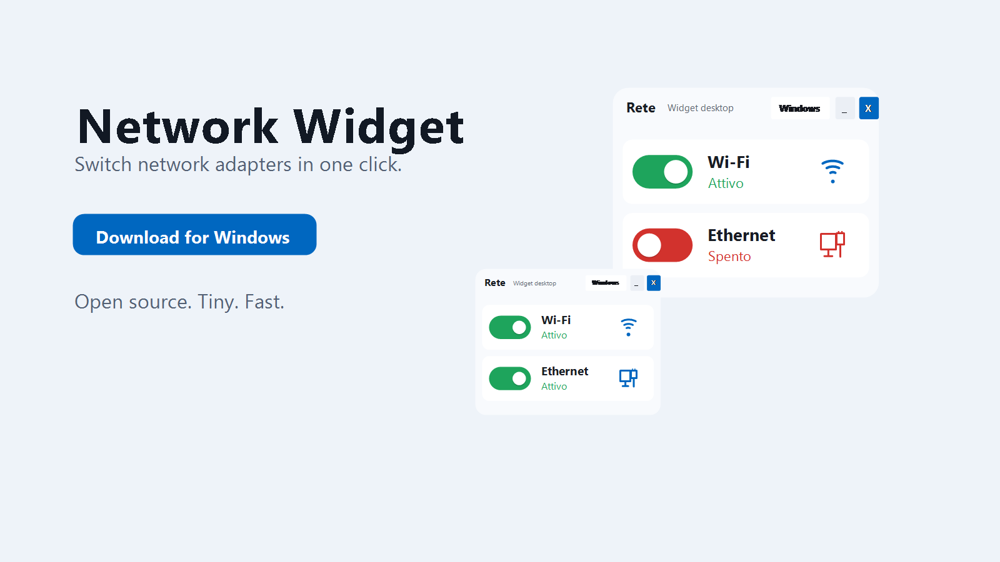
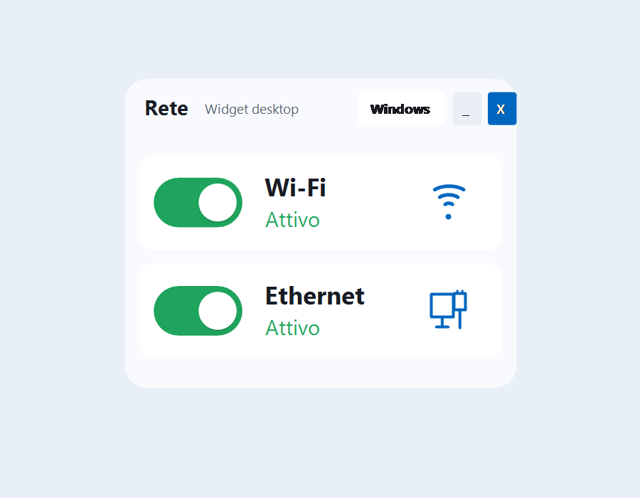
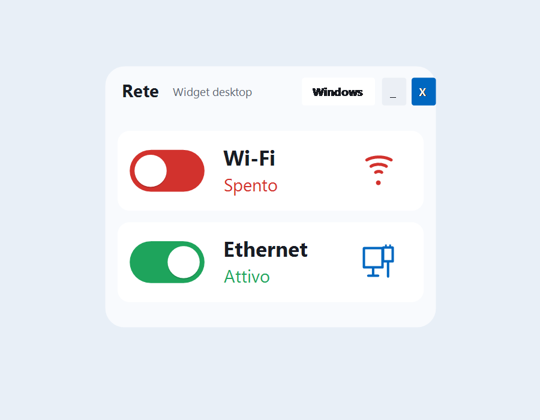

# Network Widget for Windows



A tiny Windows desktop widget for quickly enabling or disabling Wi-Fi and Ethernet adapters.

[Download the latest installer](https://github.com/don-andrea85/network-widget-windows/releases/latest/download/Installa.Network.Widget.exe)

## Why This Exists

Network Widget was built for a simple real-world problem: sometimes Wi-Fi is faster or more convenient than Ethernet, while Ethernet is still useful for stability or specific workflows.

Instead of opening Windows Settings, going into Network & Internet, finding the adapter, and enabling or disabling it manually, this widget keeps the switch one click away.

One example use case: keep Ethernet disabled when Wi-Fi gives better download performance, then switch adapters quickly when another connection mode is needed.

## Screenshots





## Features

- Toggle Wi-Fi and Ethernet adapters from a compact desktop widget
- Green active state and red disabled state
- Resizable, borderless Windows-style UI
- Notification area icon with `Apri` and `Esci`
- Optional elevated scheduled tasks to avoid repeated UAC prompts
- Starts automatically with Windows
- DPI-aware rendering for high-resolution displays
- No external icon assets: network icons are drawn in code

## Requirements

- Windows 10 or Windows 11
- .NET Framework 4.x runtime
- Administrator permission once if you want no UAC prompt on every adapter toggle

## Install

Download and run the latest installer:

```text
Installa.Network.Widget.exe
```

For the smoothest experience, run the installer as administrator once. This lets it register the elevated scheduled tasks used for adapter changes.

## Usage

- Click the Wi-Fi or Ethernet switch to enable or disable that adapter.
- Click `_` to hide the widget in the notification area.
- Double-click the tray icon to show the widget again.
- Right-click the tray icon for `Apri` or `Esci`.
- Drag the widget body to move it.
- Drag the bottom-right grip to resize it.
- Click the theme button to cycle colors.

## UAC Notes

Windows requires elevation to enable or disable network adapters.

Network Widget can avoid asking for UAC on every click by registering four elevated scheduled tasks:

- `\NetworkWidget\WiFiEnable`
- `\NetworkWidget\WiFiDisable`
- `\NetworkWidget\EthernetEnable`
- `\NetworkWidget\EthernetDisable`

If those tasks are not registered, the app falls back to the normal UAC prompt.

## Build

Run from the repository root:

```powershell
powershell -ExecutionPolicy Bypass -File .\scripts\build.ps1
```

The installer is produced at:

```text
dist/Installa Network Widget.exe
```

The build script uses the C# compiler included with .NET Framework:

```text
C:\Windows\Microsoft.NET\Framework64\v4.0.30319\csc.exe
```

## License

MIT License. See [LICENSE](LICENSE).
